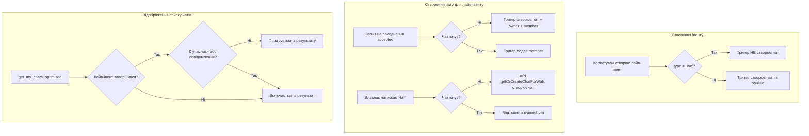

# Дизайн-документ: Покращення чатів лайв-івентів

## Огляд

Цей документ описує технічний дизайн чотирьох покращень системи чатів для лайв-івентів у додатку LocalMeet:

1. **Ліниве створення чатів** — груповий чат для лайв-івентів створюється лише при першому прийнятті запиту або за запитом власника, а не автоматично при створенні івенту.
2. **Приховування порожніх чатів** — порожні чати завершених лайв-івентів фільтруються в RPC-функції `get_my_chats_optimized` (не видаляються з БД).
3. **Покращення назви/аватара** — для лайв-івентів відображається аватар власника та форматована назва ("Прогулянка [ім'я]" / "Твоя прогулянка · дата").
4. **Зміна заголовка екрану деталей** — для лайв-івентів заголовок навігаційної панелі показує "Прогулянка" замість `walk.title`.

Усі зміни стосуються виключно лайв-івентів (`type = 'live'`). Поведінка звичайних івентів (`type = 'event'`) залишається без змін.

## Архітектура

### Діаграма потоку даних



### Шари змін

| Шар | Компоненти | Зміни |
|-----|-----------|-------|
| **Database** | Тригери, RPC-функції | Модифікація тригерів, оновлення RPC |
| **API** | `chats.ts`, `walks.ts` | Нова функція `getOrCreateChatForWalk`, оновлення типів |
| **UI** | `ChatsListScreen`, `ChatHeader`, `EventDetailsScreen` | Логіка відображення назв/аватарів |
| **i18n** | `en.json`, `uk.json` | Нові ключі локалізації |

## Компоненти та інтерфейси

### 1. Database Triggers

#### Модифікація `create_group_chat_on_walk_insert()`

Поточна поведінка: створює груповий чат для кожного нового запису в `walks`.

Нова поведінка: перевіряє `NEW.type` — якщо `'live'`, пропускає створення чату.

```sql
CREATE OR REPLACE FUNCTION public.create_group_chat_on_walk_insert()
RETURNS TRIGGER AS $$
DECLARE
  new_chat_id UUID;
BEGIN
  -- Пропустити створення чату для лайв-івентів
  IF NEW.type = 'live' THEN
    RETURN NEW;
  END IF;

  INSERT INTO public.chats (type, walk_id)
  VALUES ('group', NEW.id)
  RETURNING id INTO new_chat_id;
  
  INSERT INTO public.chat_participants (chat_id, user_id, role)
  VALUES (new_chat_id, NEW.user_id, 'owner');
  
  RETURN NEW;
END;
$$ LANGUAGE plpgsql SECURITY DEFINER SET search_path TO 'public';
```

#### Модифікація `add_participant_on_request_accept()`

Поточна поведінка: шукає існуючий чат і додає учасника.

Нова поведінка: якщо чат не існує (лайв-івент), створює чат, додає власника як `owner` і нового учасника як `member`.

```sql
CREATE OR REPLACE FUNCTION public.add_participant_on_request_accept()
RETURNS TRIGGER AS $$
DECLARE
  target_chat_id UUID;
  walk_owner_id UUID;
BEGIN
  IF NEW.status = 'accepted' AND (OLD.status IS NULL OR OLD.status != 'accepted') THEN
    SELECT id INTO target_chat_id
    FROM public.chats
    WHERE walk_id = NEW.walk_id AND type = 'group'
    LIMIT 1;
    
    IF target_chat_id IS NULL THEN
      -- Чат не існує (лайв-івент) — створюємо
      SELECT user_id INTO walk_owner_id
      FROM public.walks
      WHERE id = NEW.walk_id;
      
      INSERT INTO public.chats (type, walk_id)
      VALUES ('group', NEW.walk_id)
      RETURNING id INTO target_chat_id;
      
      INSERT INTO public.chat_participants (chat_id, user_id, role)
      VALUES (target_chat_id, walk_owner_id, 'owner');
    END IF;
    
    INSERT INTO public.chat_participants (chat_id, user_id, role)
    VALUES (target_chat_id, NEW.requester_id, 'member')
    ON CONFLICT (chat_id, user_id) DO NOTHING;
  END IF;
  
  RETURN NEW;
END;
$$ LANGUAGE plpgsql SECURITY DEFINER SET search_path TO 'public';
```

### 2. RPC Functions

#### Оновлення `get_my_chats_optimized`

Додаємо:
- Нові поля: `creator_avatar_url`, `creator_first_name`, `walk_type`
- Фільтр: виключаємо порожні чати завершених лайв-івентів

Логіка фільтрації:
```sql
WHERE NOT (
  w.type = 'live'
  AND (w.start_time + (w.duration * INTERVAL '1 second')) < NOW()
  AND participant_count = 1  -- лише owner
  AND message_count = 0
)
```

Нові поля в `RETURNS TABLE`:
```sql
creator_avatar_url TEXT,
creator_first_name TEXT,
walk_type TEXT
```

Ці поля отримуються через JOIN з `profiles` по `user_id` з `walks`.

#### Оновлення `get_chat_details`

Додаємо ті ж нові поля: `creator_avatar_url`, `creator_first_name`, `walk_type`.

Також через JOIN з `profiles` по `walks.user_id`.

### 3. API Layer (`src/shared/lib/api/chats.ts`)

#### Нова функція `getOrCreateChatForWalk`

```typescript
export async function getOrCreateChatForWalk(
  walkId: string, 
  userId: string
): Promise<string> {
  // 1. Спробувати знайти існуючий чат
  const existingChatId = await getChatByWalkId(walkId);
  if (existingChatId) return existingChatId;
  
  // 2. Створити чат + додати owner
  const { data: chat } = await supabase
    .from('chats')
    .insert({ type: 'group', walk_id: walkId })
    .select('id')
    .single();
  
  await supabase
    .from('chat_participants')
    .insert({ chat_id: chat.id, user_id: userId, role: 'owner' });
  
  return chat.id;
}
```

#### Оновлення інтерфейсу `ChatWithDetails`

```typescript
export interface ChatWithDetails {
  // ... існуючі поля
  creator_avatar_url?: string | null;
  creator_first_name?: string;
  walk_type?: 'event' | 'live';
}
```

#### Оновлення `getMyChats` та `getChatDetails`

Маппінг нових полів з RPC-результату в `ChatWithDetails`.

### 4. UI Components

#### `ChatsListScreen.tsx` — логіка назви/аватара

```typescript
// В renderChatItem:
const isLiveEvent = item.walk_type === 'live';

if (isGroupChat && isLiveEvent) {
  const isCreator = item.creator_first_name && /* визначити чи поточний user є owner */;
  
  if (isCreator) {
    displayName = `${t('yourWalk')} · ${formatDateLabel(item.walk_start_time)}`;
  } else {
    displayName = t('walkOfName', { name: item.creator_first_name });
  }
  avatarUrl = item.creator_avatar_url || null;
} else if (isGroupChat) {
  // Існуюча логіка для звичайних івентів
}
```

#### `ChatHeader.tsx` — логіка назви/аватара

Аналогічна логіка для заголовка чату:
- Лайв-івент + не власник → "Прогулянка [ім'я]"
- Лайв-івент + власник → "Твоя прогулянка"
- Звичайний івент → без змін

Аватар: для лайв-івентів показуємо `creator_avatar_url` через компонент `Avatar` замість `CachedImage` з `walk_image_url`.

#### `EventDetailsScreen.tsx` — заголовок

```typescript
// В заголовку навігаційної панелі:
const headerTitle = walk?.type === 'live' ? t('walkTitle') : (walk?.title || '');
```

Для стану помилки (walk не знайдено) також показуємо `t('walkTitle')`.

#### `EventDetailsScreen.tsx` — кнопка "Чат"

Для лайв-івентів замість `getChatByWalkId` використовуємо `getOrCreateChatForWalk`:

```typescript
const handleOpenGroupChat = async () => {
  if (!walk?.id || !currentUser?.id) return;
  try {
    let chatId: string | null;
    if (walk.type === 'live') {
      chatId = await getOrCreateChatForWalk(walk.id, currentUser.id);
    } else {
      chatId = await getChatByWalkId(walk.id);
    }
    if (chatId) router.push(`/chat/${chatId}`);
    else setError(t('groupChatNotFound'));
  } catch (error) {
    setError(t('errorOpeningChat'));
  }
};
```

### 5. i18n Keys

| Ключ | EN | UK |
|------|----|----|
| `walkTitle` | `"Walk"` | `"Прогулянка"` |
| `walkOfName` | `"{{name}}'s walk"` | `"Прогулянка {{name}}"` |
| `yourWalk` | `"Your walk"` | `"Твоя прогулянка"` |

## Моделі даних

### Зміни в RPC `get_my_chats_optimized`

Нові поля в результаті:

| Поле | Тип | Опис |
|------|-----|------|
| `creator_avatar_url` | `TEXT` | URL аватара власника івенту |
| `creator_first_name` | `TEXT` | Ім'я власника івенту |
| `walk_type` | `TEXT` | Тип івенту (`'event'` або `'live'`) |

### Зміни в RPC `get_chat_details`

Ті ж нові поля: `creator_avatar_url`, `creator_first_name`, `walk_type`.

### Зміни в `ChatWithDetails` інтерфейсі

```typescript
interface ChatWithDetails {
  id: string;
  type: 'group' | 'direct';
  walk_id: string | null;
  walk_title?: string;
  walk_image_url?: string | null;
  walk_start_time?: string;
  // Нові поля:
  creator_avatar_url?: string | null;
  creator_first_name?: string;
  walk_type?: 'event' | 'live';
  // ... решта існуючих полів
}
```

### Зміни в `database.types.ts`

Після міграції потрібно перегенерувати типи. Нові поля з'являться в:
- `Database['public']['Functions']['get_my_chats_optimized']['Returns']`
- `Database['public']['Functions']['get_chat_details']['Returns']`


## Властивості коректності

*Властивість — це характеристика або поведінка, яка повинна бути істинною для всіх допустимих виконань системи. Властивості слугують мостом між людино-читабельними специфікаціями та машинно-верифікованими гарантіями коректності.*

### Властивість 1: Лайв-івенти не створюють чат при вставці

*Для будь-якого* нового запису в таблиці `walks` з `type = 'live'`, після вставки в таблиці `chats` не повинно з'явитися нового запису з `walk_id` рівним ID цього лайв-івенту.

**Validates: Requirements 1.1**

### Властивість 2: Звичайні івенти створюють чат при вставці

*Для будь-якого* нового запису в таблиці `walks` з `type = 'event'`, після вставки в таблиці `chats` повинен з'явитися новий запис з `walk_id` рівним ID цього івенту, а в `chat_participants` — запис з `role = 'owner'` для `user_id` власника.

**Validates: Requirements 1.2**

### Властивість 3: Прийняття запиту для лайв-івенту без чату створює чат з owner та member

*Для будь-якого* лайв-івенту без існуючого групового чату, коли статус запиту на приєднання змінюється на `accepted`, система повинна створити груповий чат з двома учасниками: власник івенту з `role = 'owner'` та автор запиту з `role = 'member'`.

**Validates: Requirements 1.3**

### Властивість 4: Прийняття запиту для івенту з існуючим чатом додає member

*Для будь-якого* івенту (будь-якого типу) з існуючим груповим чатом, коли статус запиту на приєднання змінюється на `accepted`, кількість учасників чату повинна збільшитися на 1, а новий учасник повинен мати `role = 'member'`.

**Validates: Requirements 1.4**

### Властивість 5: getOrCreateChatForWalk — ідемпотентність

*Для будь-якого* лайв-івенту, виклик `getOrCreateChatForWalk` двічі поспіль повинен повернути один і той самий `chat_id`, і в базі повинен існувати рівно один чат для цього `walk_id`.

**Validates: Requirements 1.5**

### Властивість 6: Фільтрація порожніх завершених лайв-чатів

*Для будь-якого* групового чату, пов'язаного з лайв-івентом, що завершився (`start_time + duration < now()`), цей чат з'являється в результаті `get_my_chats_optimized` тоді і тільки тоді, коли він має хоча б одного учасника крім власника АБО хоча б одне повідомлення.

**Validates: Requirements 2.1, 2.2, 2.3**

### Властивість 7: Звичайні івенти завжди в списку чатів

*Для будь-якого* групового чату, пов'язаного зі звичайним івентом (`type = 'event'`), цей чат завжди повинен з'являтися в результаті `get_my_chats_optimized`, незалежно від кількості учасників чи повідомлень.

**Validates: Requirements 2.4**

### Властивість 8: Приховані чати зберігаються в БД

*Для будь-якого* порожнього завершеного лайв-чату, який не з'являється в результаті `get_my_chats_optimized`, запис цього чату повинен існувати в таблиці `chats`.

**Validates: Requirements 2.5**

### Властивість 9: RPC повертає поля creator для групових чатів

*Для будь-якого* групового чату, результат `get_my_chats_optimized` та `get_chat_details` повинен містити поля `creator_avatar_url`, `creator_first_name` та `walk_type`, де `creator_first_name` відповідає `first_name` профілю власника івенту, а `walk_type` відповідає полю `type` з таблиці `walks`.

**Validates: Requirements 3.1, 3.2**

### Властивість 10: Форматування назви чату лайв-івенту

*Для будь-якого* групового чату лайв-івенту з відомим `creator_first_name` та `walk_type = 'live'`:
- якщо поточний користувач НЕ є власником, назва повинна відповідати шаблону `t('walkOfName', { name: creator_first_name })`
- якщо поточний користувач є власником, назва повинна починатися з `t('yourWalk')`

**Validates: Requirements 3.3, 3.9, 3.10**

### Властивість 11: Аватар чату лайв-івенту — аватар власника

*Для будь-якого* групового чату лайв-івенту, URL аватара, що використовується для відображення, повинен дорівнювати `creator_avatar_url`, а не `walk_image_url`.

**Validates: Requirements 3.7, 3.11**

### Властивість 12: Звичайні івенти — відображення без змін

*Для будь-якого* групового чату звичайного івенту (`walk_type = 'event'`), назва повинна дорівнювати `walk_title`, а аватар — `walk_image_url` (або аватар першого учасника як fallback), як і до змін.

**Validates: Requirements 3.8, 3.12**

### Властивість 13: Заголовок екрану деталей лайв-івенту

*Для будь-якого* лайв-івенту на екрані деталей, заголовок навігаційної панелі повинен дорівнювати `t('walkTitle')`, а не `walk.title`.

**Validates: Requirements 4.1**

### Властивість 14: Заголовок екрану деталей звичайного івенту — без змін

*Для будь-якого* звичайного івенту на екрані деталей, заголовок навігаційної панелі повинен дорівнювати `walk.title`.

**Validates: Requirements 4.2**

## Обробка помилок

| Сценарій | Обробка |
|----------|---------|
| Помилка створення чату в `getOrCreateChatForWalk` | Функція кидає виключення → UI показує `t('errorOpeningChat')` |
| Помилка створення чату в тригері `add_participant_on_request_accept` | Транзакція відкочується, запит залишається в попередньому стані |
| RPC `get_my_chats_optimized` повертає помилку | Існуюча обробка в `useChatsData` — показує повідомлення про помилку |
| `creator_avatar_url` або `creator_first_name` є NULL | UI використовує fallback: стандартний аватар (компонент `Avatar` обробляє null), назва — `t('groupChat')` |
| `walk_type` не визначено (старі чати без міграції) | Трактується як `'event'` (існуюча поведінка) |

## Стратегія тестування

### Unit-тести

- Перевірка форматування назви чату для лайв-івентів (різні комбінації: owner/non-owner, today/yesterday/other date)
- Перевірка вибору аватара (live → creator_avatar_url, event → walk_image_url)
- Перевірка заголовка екрану деталей (live → t('walkTitle'), event → walk.title)
- Перевірка наявності нових i18n ключів в обох файлах локалізації
- Перевірка fallback значень при відсутності `creator_first_name` або `creator_avatar_url`

### Property-based тести

Бібліотека: **fast-check** (вже використовується в проєкті для database тестів)

Конфігурація: мінімум 100 ітерацій на тест.

Кожен тест повинен мати коментар з посиланням на властивість:
```
// Feature: chat-improvements, Property N: [назва властивості]
```

Тести для database-рівня (тригери, RPC):
- **Property 1**: Генерувати випадкові лайв-івенти, вставляти в `walks`, перевіряти відсутність чату
- **Property 2**: Генерувати випадкові звичайні івенти, вставляти в `walks`, перевіряти наявність чату з owner
- **Property 3**: Генерувати лайв-івенти без чату + запити, приймати запит, перевіряти створення чату з owner + member
- **Property 4**: Генерувати івенти з чатом + запити, приймати запит, перевіряти додавання member
- **Property 5**: Генерувати лайв-івенти, викликати getOrCreateChatForWalk двічі, перевіряти ідемпотентність
- **Property 6**: Генерувати завершені лайв-івенти з різними комбінаціями (з/без учасників, з/без повідомлень), перевіряти фільтрацію
- **Property 7**: Генерувати звичайні івенти (порожні та з учасниками), перевіряти що завжди в списку
- **Property 8**: Після фільтрації, перевіряти що запис чату існує в таблиці `chats`
- **Property 9**: Для будь-якого групового чату, перевіряти наявність та коректність полів creator

Тести для UI-рівня (форматування):
- **Property 10**: Генерувати випадкові імена та ролі, перевіряти формат назви
- **Property 11**: Генерувати випадкові чати з walk_type, перевіряти вибір аватара
- **Property 12**: Генерувати звичайні івенти, перевіряти що назва = walk_title
- **Property 13-14**: Генерувати івенти різних типів, перевіряти заголовок

### Підхід до тестування

- **Unit-тести**: конкретні приклади, edge cases (today/yesterday), error states
- **Property-тести**: універсальні властивості з рандомізованими вхідними даними
- Обидва типи доповнюють один одного для повного покриття
