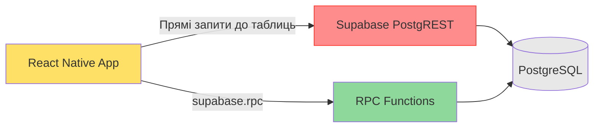
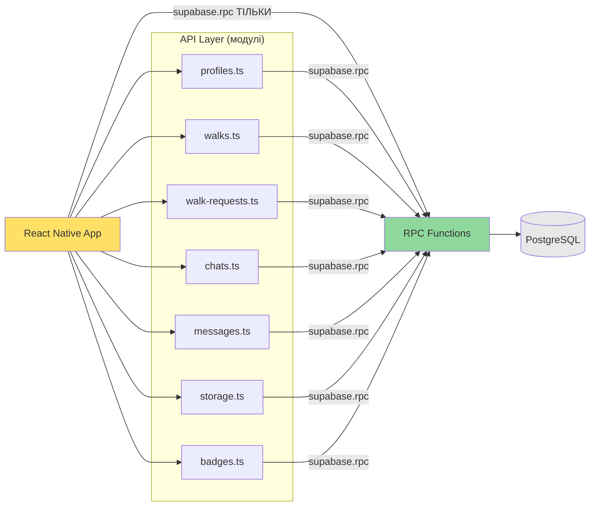
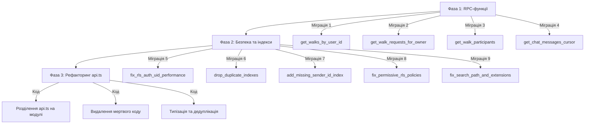

# Дизайн-документ: Production Database Optimization

## Огляд

Цей документ описує технічний дизайн комплексної оптимізації Supabase-шару бази даних для мобільного додатку LocalMeet. Оптимізація охоплює три напрямки:

1. **Абстракція через RPC** — міграція прямих запитів до таблиць на серверні PostgreSQL-функції для створення стабільного API-контракту між клієнтом і базою даних. Це дозволяє змінювати схему БД без необхідності оновлення мобільного додатку.

2. **Безпека та продуктивність** — виправлення RLS-політик (`auth.uid()` → `(select auth.uid())`), видалення дублікатів індексів, додавання відсутніх індексів, посилення надмірно дозвільних політик, виправлення `search_path` та переміщення розширень.

3. **Рефакторинг клієнтського коду** — розділення монолітного `api.ts` (1371 рядок) на доменні модулі, видалення мертвого коду, усунення дублювання, заміна `any` на згенеровані типи.

Ключове обмеження: мобільний додаток має кілька версій одночасно в продакшені. RPC-функції створюють стабільний контракт, який можна оновлювати на сервері без необхідності оновлення додатку.

## Архітектура

### Поточна архітектура (проблеми)



Проблеми поточної архітектури:
- 8 функцій в `api.ts` використовують прямі запити `supabase.from('table')` — зміна схеми ламає старі версії додатку
- N+1 патерн у `getMyWalkRequests`, `getPendingWalkRequests`, `getPastWalkRequests` (3 окремі запити замість одного JOIN)
- Offset-пагінація в `getChatMessages` — деградація на великих таблицях
- RLS-політики з `auth.uid()` без кешування — per-row re-evaluation

### Цільова архітектура



Після оптимізації:
- Всі складні читання через RPC-функції
- Прямі запити залишаються лише для простих CRUD (insert, update, delete одного рядка)
- Курсорна пагінація замість offset
- `api.ts` розділений на 7 доменних модулів з реекспортом

### Стратегія міграції

Міграції виконуються в 3 фази для мінімізації ризику:



Фаза 1 (RPC) може деплоїтись незалежно — нові RPC-функції не ламають існуючий код, а клієнтський код перемикається на них поступово.

Фаза 2 (безпека/індекси) — зворотно сумісна, окрім посилення RLS (потребує перевірки тригерів).

Фаза 3 (рефакторинг) — чисто клієнтська, не впливає на БД.


## Компоненти та інтерфейси

### Нові RPC-функції (Фаза 1)

#### 1. `get_walks_by_user_id` (Вимога 1)

```sql
CREATE OR REPLACE FUNCTION get_walks_by_user_id(p_user_id UUID)
RETURNS TABLE (
  id UUID,
  user_id UUID,
  title TEXT,
  start_time TIMESTAMPTZ,
  duration BIGINT,
  description TEXT,
  latitude NUMERIC,
  longitude NUMERIC,
  image_url TEXT,
  type TEXT
)
LANGUAGE plpgsql
SECURITY DEFINER
SET search_path TO 'public'
AS $$
BEGIN
  RETURN QUERY
  SELECT
    w.id,
    w.user_id,
    w.title,
    w.start_time,
    w.duration,
    w.description,
    w.latitude,
    w.longitude,
    w.image_url,
    w.type
  FROM walks w
  WHERE w.user_id = p_user_id
    AND w.deleted = false
  ORDER BY w.start_time ASC;
END;
$$;

COMMENT ON FUNCTION get_walks_by_user_id IS 'Повертає активні прогулянки користувача, відсортовані за часом початку';
```

**Рішення**: `SECURITY DEFINER` — функція обходить RLS, бо фільтрація по `user_id` вже вбудована в запит. Це ефективніше, ніж RLS + додатковий фільтр.

#### 2. `get_walk_requests_for_owner` (Вимога 2)

```sql
CREATE OR REPLACE FUNCTION get_walk_requests_for_owner(
  p_user_id UUID,
  p_status TEXT
)
RETURNS TABLE (
  request_id UUID,
  walk_id UUID,
  requester_id UUID,
  message TEXT,
  status TEXT,
  request_created_at TIMESTAMPTZ,
  request_updated_at TIMESTAMPTZ,
  -- Walk fields
  walk_title TEXT,
  walk_start_time TIMESTAMPTZ,
  walk_duration BIGINT,
  walk_description TEXT,
  walk_latitude NUMERIC,
  walk_longitude NUMERIC,
  walk_image_url TEXT,
  walk_type TEXT,
  walk_user_id UUID,
  -- Requester profile fields
  requester_first_name TEXT,
  requester_last_name TEXT,
  requester_bio TEXT,
  requester_avatar_url TEXT,
  requester_gender TEXT,
  requester_occupation TEXT,
  requester_languages TEXT[],
  requester_interests TEXT[],
  requester_social_instagram TEXT,
  requester_social_telegram TEXT
)
LANGUAGE plpgsql
SECURITY DEFINER
SET search_path TO 'public'
AS $$
BEGIN
  RETURN QUERY
  SELECT
    wr.id AS request_id,
    wr.walk_id,
    wr.requester_id,
    wr.message,
    wr.status,
    wr.created_at AS request_created_at,
    wr.updated_at AS request_updated_at,
    w.title AS walk_title,
    w.start_time AS walk_start_time,
    w.duration AS walk_duration,
    w.description AS walk_description,
    w.latitude AS walk_latitude,
    w.longitude AS walk_longitude,
    w.image_url AS walk_image_url,
    w.type AS walk_type,
    w.user_id AS walk_user_id,
    p.first_name AS requester_first_name,
    p.last_name AS requester_last_name,
    p.bio AS requester_bio,
    p.avatar_url AS requester_avatar_url,
    p.gender::TEXT AS requester_gender,
    p.occupation AS requester_occupation,
    p.languages AS requester_languages,
    p.interests AS requester_interests,
    p.social_instagram AS requester_social_instagram,
    p.social_telegram AS requester_social_telegram
  FROM walk_requests wr
  JOIN walks w ON w.id = wr.walk_id AND w.deleted = false
  JOIN profiles p ON p.id = wr.requester_id
  WHERE w.user_id = p_user_id
    AND (
      (p_status = 'pending' AND wr.status = 'pending')
      OR
      (p_status = 'past' AND wr.status IN ('accepted', 'rejected'))
    )
  ORDER BY
    CASE WHEN p_status = 'pending' THEN wr.created_at END DESC,
    CASE WHEN p_status = 'past' THEN wr.updated_at END DESC;
END;
$$;

COMMENT ON FUNCTION get_walk_requests_for_owner IS 'Повертає запити на прогулянки власника з профілями заявників та даними прогулянок. p_status: pending або past';
```

**Рішення**: Один JOIN замість 3 окремих запитів (усунення N+1). Параметр `p_status` визначає фільтрацію та сортування.

#### 3. `get_walk_participants` (Вимога 3)

```sql
CREATE OR REPLACE FUNCTION get_walk_participants(p_walk_id UUID)
RETURNS TABLE (
  id UUID,
  first_name TEXT,
  last_name TEXT,
  bio TEXT,
  avatar_url TEXT,
  gender TEXT,
  occupation TEXT,
  languages TEXT[],
  interests TEXT[],
  social_instagram TEXT,
  social_telegram TEXT
)
LANGUAGE plpgsql
SECURITY DEFINER
SET search_path TO 'public'
AS $$
BEGIN
  RETURN QUERY
  SELECT
    p.id,
    p.first_name,
    p.last_name,
    p.bio,
    p.avatar_url,
    p.gender::TEXT,
    p.occupation,
    p.languages,
    p.interests,
    p.social_instagram,
    p.social_telegram
  FROM walk_requests wr
  JOIN profiles p ON p.id = wr.requester_id
  WHERE wr.walk_id = p_walk_id
    AND wr.status = 'accepted';
END;
$$;

COMMENT ON FUNCTION get_walk_participants IS 'Повертає профілі учасників прогулянки (зі статусом accepted)';
```

#### 4. `get_chat_messages_cursor` (Вимога 4)

```sql
CREATE OR REPLACE FUNCTION get_chat_messages_cursor(
  p_chat_id UUID,
  p_limit INTEGER DEFAULT 50,
  p_cursor TIMESTAMPTZ DEFAULT NULL
)
RETURNS TABLE (
  id UUID,
  chat_id UUID,
  sender_id UUID,
  content TEXT,
  image_urls JSONB,
  audio_url TEXT,
  audio_duration INTEGER,
  created_at TIMESTAMPTZ,
  read BOOLEAN,
  -- Sender profile
  sender_first_name TEXT,
  sender_last_name TEXT,
  sender_avatar_url TEXT,
  sender_bio TEXT,
  sender_gender TEXT,
  sender_occupation TEXT,
  sender_languages TEXT[],
  sender_interests TEXT[],
  sender_social_instagram TEXT,
  sender_social_telegram TEXT,
  -- Pagination
  has_more BOOLEAN
)
LANGUAGE plpgsql
SECURITY DEFINER
SET search_path TO 'public'
AS $$
DECLARE
  v_total_count INTEGER;
BEGIN
  -- Підрахунок повідомлень до курсора для визначення has_more
  IF p_cursor IS NOT NULL THEN
    SELECT COUNT(*) INTO v_total_count
    FROM messages m
    WHERE m.chat_id = p_chat_id
      AND m.created_at < p_cursor;
  ELSE
    SELECT COUNT(*) INTO v_total_count
    FROM messages m
    WHERE m.chat_id = p_chat_id;
  END IF;

  RETURN QUERY
  SELECT
    m.id,
    m.chat_id,
    m.sender_id,
    m.content,
    m.image_urls,
    m.audio_url,
    m.audio_duration,
    m.created_at,
    m.read,
    p.first_name AS sender_first_name,
    p.last_name AS sender_last_name,
    p.avatar_url AS sender_avatar_url,
    p.bio AS sender_bio,
    p.gender::TEXT AS sender_gender,
    p.occupation AS sender_occupation,
    p.languages AS sender_languages,
    p.interests AS sender_interests,
    p.social_instagram AS sender_social_instagram,
    p.social_telegram AS sender_social_telegram,
    (v_total_count > p_limit) AS has_more
  FROM messages m
  JOIN profiles p ON p.id = m.sender_id
  WHERE m.chat_id = p_chat_id
    AND (p_cursor IS NULL OR m.created_at < p_cursor)
  ORDER BY m.created_at DESC
  LIMIT p_limit;
END;
$$;

COMMENT ON FUNCTION get_chat_messages_cursor IS 'Повертає повідомлення чату з курсорною пагінацією. p_cursor = NULL для першої сторінки';
```

**Рішення**: Курсорна пагінація (keyset) замість offset. Використовує `created_at` як курсор. `has_more` дозволяє клієнту знати, чи є ще повідомлення.

### Зміни безпеки та індексів (Фаза 2)

#### RLS-політики з `(select auth.uid())` (Вимога 5)

Всі політики на таблицях `chats`, `messages`, `chat_participants` оновлюються за шаблоном:

```sql
-- Приклад: замість
USING (user_id = auth.uid())
-- Стає
USING (user_id = (select auth.uid()))
```

Це кешує результат `auth.uid()` один раз на запит замість обчислення на кожному рядку.

#### Видалення дублікатів індексів (Вимога 6)

```sql
DROP INDEX IF EXISTS chat_participants_user_chat_idx;
-- Залишається idx_chat_participants_user_chat

DROP INDEX IF EXISTS idx_messages_badge_counts;
-- Залишається messages_unread_by_chat_idx
```

#### Додавання індексу `messages.sender_id` (Вимога 7)

```sql
CREATE INDEX IF NOT EXISTS idx_messages_sender_id ON messages(sender_id);
```

#### Посилення RLS-політик (Вимога 8)

Замість `WITH CHECK (true)` для INSERT на `chat_participants` та `chats`:

```sql
-- Видаляємо надмірно дозвільні політики
DROP POLICY IF EXISTS "System can insert participants" ON chat_participants;
DROP POLICY IF EXISTS "System can create chats" ON chats;

-- Нові обмежені політики
-- Для chat_participants: користувач може додати лише себе (для direct чатів)
CREATE POLICY "Users can insert themselves as participants"
ON chat_participants FOR INSERT TO authenticated
WITH CHECK (user_id = (select auth.uid()));

-- Для chats: тільки direct чати можуть створюватись клієнтом
CREATE POLICY "Users can create direct chats"
ON chats FOR INSERT TO authenticated
WITH CHECK (type = 'direct');
```

Тригери `create_group_chat_on_walk_insert` та `add_participant_on_request_accept` вже використовують `SECURITY DEFINER`, тому вони обходять RLS і продовжують працювати.

#### Виправлення search_path та розширень (Вимога 9)

```sql
-- Виправлення search_path
CREATE OR REPLACE FUNCTION reset_walk_request_on_leave_chat()
RETURNS TRIGGER
LANGUAGE plpgsql
SECURITY DEFINER
SET search_path TO 'public'
AS $$
BEGIN
  -- ... існуюча логіка ...
END;
$$;

-- Переміщення розширень
CREATE SCHEMA IF NOT EXISTS extensions;
ALTER EXTENSION cube SET SCHEMA extensions;
ALTER EXTENSION earthdistance SET SCHEMA extensions;

-- Оновлення функцій, що використовують earthdistance
-- Додаємо extensions до search_path
SET search_path TO 'public', 'extensions';
```

**Рішення**: Замість кваліфікації кожного виклику `ll_to_earth` / `earth_distance`, додаємо `extensions` до `search_path` відповідних функцій: `SET search_path TO 'public', 'extensions'`.

### Рефакторинг api.ts (Фаза 3)

#### Структура модулів (Вимога 10)

```
src/shared/lib/
├── api.ts                    # Реекспорт всіх модулів (зворотна сумісність)
├── api/
│   ├── profiles.ts           # updateProfile, getProfile, getProfiles
│   ├── walks.ts              # createWalk, createLiveWalk, deleteWalk, getWalksByUserId, getWalkById
│   ├── walk-requests.ts      # createWalkRequest, updateWalkRequestStatus, getMyRequestForWalk,
│   │                         # getWalkRequests, getPastWalkRequests, getWalkParticipants
│   ├── chats.ts              # getMyChats, getChatDetails, getChatByWalkId, leaveChat,
│   │                         # removeChatParticipant, deleteChat
│   ├── messages.ts           # getChatMessages, sendMessage, markChatAsRead
│   ├── storage.ts            # uploadImage, uploadAvatar, uploadEventImage, takePhotoAndUploadAvatar
│   └── badges.ts             # getBadgeCounts, setupBadgeSubscriptions
├── database.types.ts         # Автогенеровані типи (без змін)
└── supabase.ts               # Клієнт Supabase (додати Database generic)
```

#### Головний файл api.ts (реекспорт)

```typescript
// src/shared/lib/api.ts — зворотна сумісність
export * from './api/profiles';
export * from './api/walks';
export * from './api/walk-requests';
export * from './api/chats';
export * from './api/messages';
export * from './api/storage';
export * from './api/badges';
```

Всі існуючі імпорти `import { ... } from '@shared/lib/api'` продовжують працювати без змін.

#### Типізація Supabase-клієнта (Вимога 12.5)

```typescript
// src/shared/lib/supabase.ts
import { createClient } from '@supabase/supabase-js';
import AsyncStorage from '@react-native-async-storage/async-storage';
import type { Database } from './database.types';

const supabaseUrl = process.env.EXPO_PUBLIC_SUPABASE_URL || '';
const supabaseAnonKey = process.env.EXPO_PUBLIC_SUPABASE_ANON_KEY || '';

export const supabase = createClient<Database>(supabaseUrl, supabaseAnonKey, {
  auth: {
    storage: AsyncStorage,
    autoRefreshToken: true,
    persistSession: true,
    detectSessionInUrl: false,
  },
});
```

#### Видалення мертвого коду (Вимога 11)

Видаляються:
- `ChatWithLastMessage` інтерфейс
- `getChatMessagesLegacy` функція
- `getMyChatsLegacy` (закоментована)
- `sendTextMessage` та `sendAudioMessage` (дублікати `sendMessage`)
- Ручне каскадне видалення в `deleteChat` (БД має ON DELETE CASCADE)

#### Дедуплікація upload-функцій (Вимога 12.1)

```typescript
// src/shared/lib/api/storage.ts
async function uploadImage(
  bucket: 'avatars' | 'event-images' | 'chat-images',
  userId: string,
  imageUri: string
): Promise<string> {
  const response = await fetch(imageUri);
  const blob = await response.blob();
  const reader = new FileReader();
  
  const fileData = await new Promise<ArrayBuffer>((resolve, reject) => {
    reader.onloadend = () => {
      if (reader.result instanceof ArrayBuffer) resolve(reader.result);
      else reject(new Error('Failed to read file'));
    };
    reader.onerror = reject;
    reader.readAsArrayBuffer(blob);
  });

  const ext = imageUri.split('.').pop()?.split('?')[0] || 'jpg';
  const fileName = `${userId}/${Date.now()}.${ext}`;

  const { error } = await supabase.storage
    .from(bucket)
    .upload(fileName, fileData, { contentType: `image/${ext}`, upsert: false });

  if (error) throw error;

  const { data: urlData } = supabase.storage.from(bucket).getPublicUrl(fileName);
  return urlData.publicUrl;
}

export async function uploadAvatar(userId: string, imageUri: string): Promise<string> {
  return uploadImage('avatars', userId, imageUri);
}

export async function uploadEventImage(userId: string, imageUri: string): Promise<string> {
  return uploadImage('event-images', userId, imageUri);
}
```


## Моделі даних

### Нові типи RPC-функцій (автогенеровані)

Після створення міграцій та регенерації типів, `database.types.ts` автоматично отримає нові типи:

```typescript
// Автогенеровані типи (приклад структури)
Database['public']['Functions']['get_walks_by_user_id']['Returns'][number]
Database['public']['Functions']['get_walk_requests_for_owner']['Returns'][number]
Database['public']['Functions']['get_walk_participants']['Returns'][number]
Database['public']['Functions']['get_chat_messages_cursor']['Returns'][number]
```

### Оновлені типи в api.ts

```typescript
// Тип-аліаси для RPC-функцій (додаються до існуючих)
type GetWalksByUserIdRow = Database['public']['Functions']['get_walks_by_user_id']['Returns'][number];
type GetWalkRequestsForOwnerRow = Database['public']['Functions']['get_walk_requests_for_owner']['Returns'][number];
type GetWalkParticipantsRow = Database['public']['Functions']['get_walk_participants']['Returns'][number];
type GetChatMessagesCursorRow = Database['public']['Functions']['get_chat_messages_cursor']['Returns'][number];
```

### Зміни в існуючих інтерфейсах

Інтерфейси `Walk`, `UserProfile`, `WalkRequest`, `Message`, `ChatWithDetails` залишаються без змін — RPC-функції повертають ті ж поля, що й поточні прямі запити. Маппінг відбувається в API-функціях.

### Зміни в сигнатурах API-функцій

```typescript
// getChatMessages — зміна сигнатури
// Було:
export async function getChatMessages(chatId: string, limit?: number, offset?: number): Promise<Message[]>
// Стало:
export async function getChatMessages(chatId: string, limit?: number, cursor?: string): Promise<{ messages: Message[]; hasMore: boolean }>

// getWalksByUserId — без зміни сигнатури (внутрішня реалізація змінюється)
// getWalkParticipants — без зміни сигнатури
// getWalkRequests (нова) — замінює getMyWalkRequests та getPendingWalkRequests
// getPastWalkRequests — без зміни сигнатури (внутрішня реалізація змінюється)
```

**Зворотна сумісність `getChatMessages`**: Зміна типу повернення з `Message[]` на `{ messages: Message[]; hasMore: boolean }` — це breaking change. Всі виклики `getChatMessages` в компонентах потрібно оновити. Оскільки це клієнтський код, зміна безпечна (не впливає на інші версії додатку).


## Властивості коректності

*Властивість (property) — це характеристика або поведінка, яка має бути істинною для всіх допустимих виконань системи. Властивості слугують мостом між людино-читабельними специфікаціями та машинно-верифікованими гарантіями коректності.*

### Property 1: RPC get_walks_by_user_id повертає еквівалентні дані прямому запиту

*Для будь-якого* `user_id` та будь-якого набору прогулянок (включаючи видалені), результат виклику `get_walks_by_user_id(user_id)` має бути ідентичним результату прямого запиту `SELECT ... FROM walks WHERE user_id = p_user_id AND deleted = false ORDER BY start_time ASC` — ті ж рядки, ті ж поля, той же порядок.

**Validates: Requirements 1.1, 1.2**

### Property 2: RPC get_walk_requests_for_owner коректно фільтрує за статусом

*Для будь-якого* власника прогулянок та будь-якого набору walk_requests з різними статусами:
- Виклик з `p_status = 'pending'` повертає лише записи зі статусом `pending`, відсортовані за `created_at` DESC
- Виклик з `p_status = 'past'` повертає лише записи зі статусами `accepted` або `rejected`, відсортовані за `updated_at` DESC
- Кожен запис містить дані з трьох таблиць (walk_requests, profiles, walks)

**Validates: Requirements 2.1, 2.2, 2.3**

### Property 3: RPC get_walk_participants повертає лише accepted учасників

*Для будь-якої* прогулянки з довільним набором walk_requests (pending, accepted, rejected), результат `get_walk_participants(walk_id)` має містити лише профілі заявників зі статусом `accepted` і жодного іншого.

**Validates: Requirements 3.1, 3.2**

### Property 4: Курсорна пагінація повідомлень

*Для будь-якого* чату з N повідомленнями та будь-якого значення `p_limit`:
- Без курсора (`p_cursor = NULL`): повертає останні `min(N, p_limit)` повідомлень, відсортованих за `created_at` DESC
- З курсором: всі повернені повідомлення мають `created_at < p_cursor`
- `has_more = true` тоді і тільки тоді, коли існують повідомлення, що не увійшли в результат
- Послідовне проходження всіх сторінок (використовуючи `created_at` останнього повідомлення як наступний курсор) повертає всі N повідомлень без дублікатів та пропусків

**Validates: Requirements 4.1, 4.2, 4.3, 4.5**

### Property 5: Всі RLS-політики використовують кешований auth.uid()

*Для будь-якої* RLS-політики на таблицях `chats`, `messages`, `chat_participants`, `profiles`, `walks`, `walk_requests`, визначення політики (qual та with_check) не повинно містити bare `auth.uid()` без обгортки `(select ...)`.

**Validates: Requirements 5.1**

### Property 6: INSERT-політики не використовують WITH CHECK (true)

*Для будь-якої* RLS-політики типу INSERT на таблицях `chats` та `chat_participants`, визначення `with_check` не повинно бути `true` (тобто не повинно дозволяти вставку будь-яких даних будь-яким автентифікованим користувачем).

**Validates: Requirements 8.1, 8.2**

### Property 7: Реекспорт зберігає повний набір експортів

*Для будь-якої* публічної функції або типу, що експортувався з монолітного `api.ts` до рефакторингу, ця функція або тип має бути доступною через `import { ... } from '@shared/lib/api'` після розділення на модулі.

**Validates: Requirements 10.2, 10.3**

### Property 8: API-функції з RPC не використовують тип any

*Для будь-якої* API-функції, що викликає `supabase.rpc(...)`, маппінг результату не повинен використовувати тип `any` — замість цього має використовуватись згенерований тип з `Database['public']['Functions']`.

**Validates: Requirements 12.2, 12.3**

## Обробка помилок

### RPC-функції (серверна сторона)

RPC-функції використовують `SECURITY DEFINER` і не генерують власних помилок — PostgreSQL автоматично повертає помилки при:
- Невалідних параметрах (неіснуючий UUID)
- Порушенні обмежень (CHECK constraints)
- Відсутності доступу (RLS)

Клієнтський код обробляє ці помилки через існуючий патерн:

```typescript
const { data, error } = await supabase.rpc('function_name', params);
if (error) {
  console.error('Error in functionName:', error);
  throw new Error(`Failed to do X: ${error.message}`);
}
```

### Курсорна пагінація

- Невалідний курсор (timestamp у майбутньому) — повертає порожній результат, `has_more = false`
- Курсор між повідомленнями — коректно повертає повідомлення до курсора
- Одночасне додавання повідомлень під час пагінації — курсорна пагінація стабільна (нові повідомлення не зміщують сторінки, на відміну від offset)

### Міграції

- Кожна міграція атомарна (транзакція) — при помилці відкочується повністю
- `IF NOT EXISTS` / `IF EXISTS` для ідемпотентності де можливо
- `DROP POLICY IF EXISTS` перед `CREATE POLICY` для уникнення конфліктів

### Зворотна сумісність

- Старі версії додатку, що використовують прямі запити, продовжують працювати — таблиці не змінюються
- Нові RPC-функції додаються паралельно, не замінюючи існуючі
- Єдиний breaking change — `getChatMessages` змінює тип повернення (клієнтський код)

## Стратегія тестування

### Подвійний підхід

Тестування використовує два взаємодоповнюючі підходи:

1. **Unit-тести (приклади та edge cases)** — перевіряють конкретні сценарії:
   - Існування/відсутність файлів та функцій (статичний аналіз)
   - Конкретні значення індексів та політик у БД
   - Edge cases: порожні результати, невалідні параметри

2. **Property-based тести (властивості)** — перевіряють універсальні правила:
   - Еквівалентність RPC та прямих запитів (model-based)
   - Коректність фільтрації та сортування (інваріанти)
   - Повнота курсорної пагінації (round-trip)
   - Відсутність bare `auth.uid()` у всіх політиках

### Бібліотека для property-based тестування

**fast-check** — бібліотека PBT для TypeScript/JavaScript. Вже сумісна з Jest (використовується в проекті).

```bash
npm install --save-dev fast-check
```

### Конфігурація property-тестів

- Мінімум 100 ітерацій на property-тест
- Кожен тест має коментар з посиланням на property з дизайн-документа

```typescript
import fc from 'fast-check';

// Feature: production-db-optimization, Property 1: RPC get_walks_by_user_id повертає еквівалентні дані
test('Property 1: RPC returns equivalent data to direct query', () => {
  fc.assert(
    fc.property(
      fc.uuid(), // random user_id
      fc.array(walkArbitrary), // random walks
      (userId, walks) => {
        // ... перевірка еквівалентності
      }
    ),
    { numRuns: 100 }
  );
});
```

### Розподіл тестів

| Property | Тип тесту | Файл |
|----------|-----------|------|
| Property 1 (walks RPC) | PBT + unit | `__tests__/database/rpc-walks.test.ts` |
| Property 2 (walk requests RPC) | PBT + unit | `__tests__/database/rpc-walk-requests.test.ts` |
| Property 3 (participants RPC) | PBT + unit | `__tests__/database/rpc-walk-participants.test.ts` |
| Property 4 (cursor pagination) | PBT + unit | `__tests__/database/cursor-pagination.test.ts` |
| Property 5 (RLS auth.uid) | PBT | `__tests__/database/rls-performance.test.ts` |
| Property 6 (INSERT policies) | PBT | `__tests__/database/rls-security.test.ts` |
| Property 7 (реекспорт) | Unit | `__tests__/api/module-exports.test.ts` |
| Property 8 (no any) | Unit/PBT | `__tests__/api/type-safety.test.ts` |
| Вимоги 6, 7 (індекси) | Unit | `__tests__/database/indexes.test.ts` |
| Вимоги 9 (search_path) | Unit | `__tests__/database/search-path.test.ts` |
| Вимоги 11 (мертвий код) | Unit | `__tests__/api/dead-code-removal.test.ts` |
| Вимоги 13 (агент) | Unit | `__tests__/api/agent-rules.test.ts` |

### Кожна property реалізується ОДНИМ property-based тестом

Кожна з 8 властивостей коректності реалізується рівно одним `fc.assert(fc.property(...))` викликом. Unit-тести доповнюють property-тести для edge cases та конкретних прикладів.
